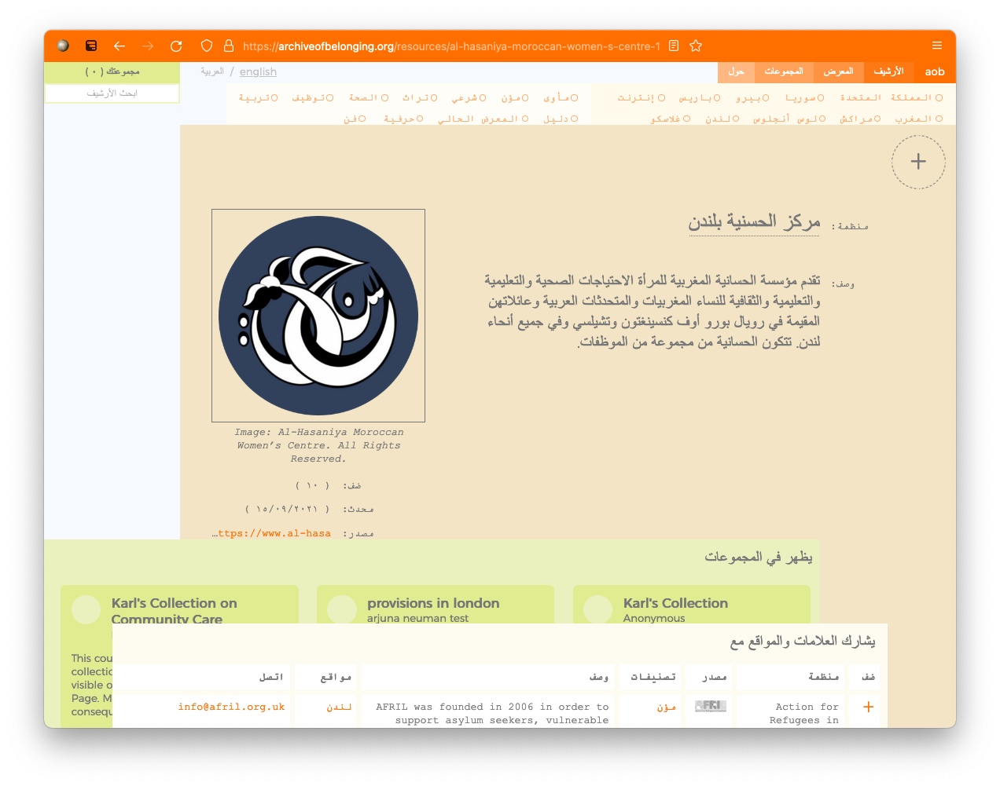

# Archive of Belonging

This is the development space for the Archive of Belonging website.

- → Current live website: https://archiveofbelonging.org.
- → Content Management System: https://api.aob.karls.computer/admin.
- → CMS documentation: https://www.karls.computer/aob/back.



### Development

The back-end is a Strapi application. Instructions are under [back](back).  

The front-end is built with Vue. Instructions are under [front](front).

First, clone the repository
```bash
git clone git@github.com:karlmoubarak/aob.git
cd aob
```

Start the back-end server (Strapi)
```bash
cd back
npm install
npm run develop
```

Start the front-end server (Vue)
```bash
cd front
npm install
npm run serve
```

Build, configuration, and production instructions for both front and back end servers are in their respective directories.

### Authors

[Karl Moubarak](https://moubarak.eu) and [Ilja Schamlé](https://iljaschamle.website/).

### License 

This project is protected under the [Creative Commons Attribution Share Alike 4.0 International](LICENSE) license. In short, this means that you are allowed to copy, appropriate, and even profit from this material, but you are required to republish it under the same license (it stays in the public domain).
